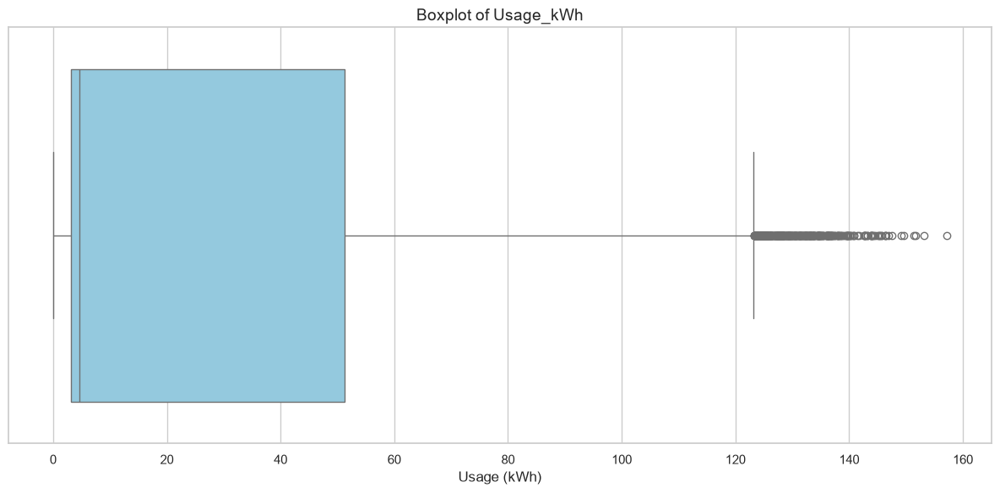
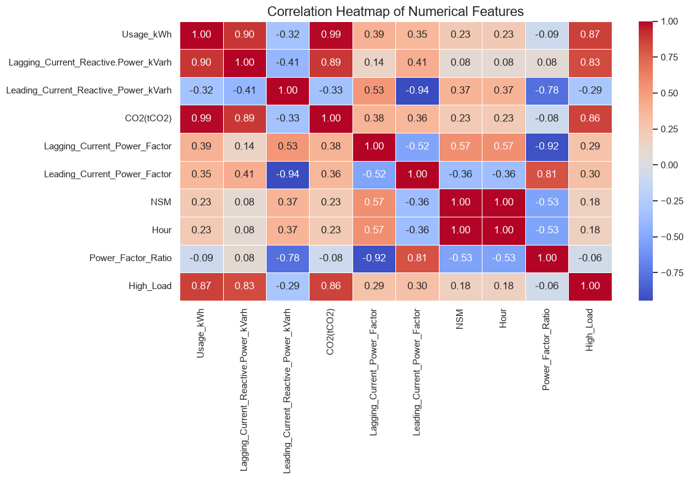
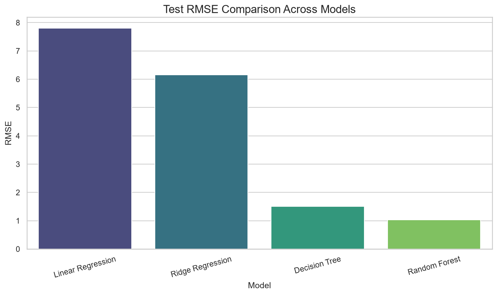

# Steel Industry Energy Consumption — Week 2 Task

## Overview
This project performs deep exploratory data analysis (EDA), feature engineering, and baseline regression modeling on the Steel Industry Energy Consumption Dataset to predict energy usage (Usage_kWh). The task is divided into two parts, each with its own notebook.

## Dataset
- **Name:** Steel Industry Energy Consumption Dataset
- **Source:** UCI Machine Learning Repository
- **Link:** https://archive.ics.uci.edu/static/public/851/steel+industry+energy+consumption.zip
- **Records:** 35,040 (15-minute interval readings from a steel manufacturing plant)
---

## Part 1 — Deep Exploratory Data Analysis & Feature Engineering
**Notebook:** `notebook/week2_eda.ipynb`

### What was done
- Converted the `date` column to datetime and extracted `Hour`, `Day_of_week`, `Month`, and `WeekStatus` (weekday/weekend)
- Created `Power_Factor_Ratio` (Leading Power Factor ÷ Lagging Power Factor)
- Created binary feature `High_Load` based on the 75th percentile of `Usage_kWh`
- Detected outliers in `Usage_kWh` using the IQR method — **328 outliers** identified
- Removed 1 row with an undefined (0/0) Power_Factor_Ratio
- Generated a correlation heatmap — top correlated features with `Usage_kWh`: **CO2(tCO2)**, **Lagging_Current_Reactive.Power_kVarh**, and **High_Load**
- Visualized average energy usage by Load Type and by hour of day

### Key Visualizations

**Boxplot — Outlier Detection in Usage_kWh**


**Correlation Heatmap**


**Average Energy Consumption by Load Type**


**Average Energy Usage by Hour of Day**


### EDA Summary
The dataset contains 35,040 clean records with no missing values (before feature engineering). Maximum Load periods show the highest average energy consumption, while Light Load periods consume the least. Energy usage fluctuates clearly with the plant's operating hours, peaking during active production periods. CO2 emissions and reactive power are strongly linked to overall energy usage, suggesting that energy spikes are driven primarily by periods of maximum industrial activity.

---

## Part 2 — Baseline Regression Modeling
**Notebook:** `notebook/week2_baseline_models.ipynb`

### What was done
- Loaded the engineered dataset produced in Part 1
- Dropped `date` and `High_Load` (target-leaking) columns
- One-hot encoded categorical features: `WeekStatus`, `Day_of_week`, `Load_Type`, `Month`
- Split data 80% train / 20% test using `random_state=42` for reproducibility
- Trained 4 models: Linear Regression, Ridge Regression, Decision Tree Regressor, Random Forest Regressor
- Evaluated using MAE, RMSE, R², and 5-fold cross-validation

### Results

**Test Set Performance**

| Model | MAE | RMSE | R² |
|---|---|---|---|
| Linear Regression | 5.4734 | 7.8014 | 0.9456 |
| Ridge Regression | 4.2987 | 6.1595 | 0.9661 |
| Decision Tree | 0.5420 | 1.5055 | 0.9980 |
| **Random Forest** | **0.3353** | **1.0277** | **0.9991** |

**5-Fold Cross-Validation (Mean RMSE)**

| Model | CV Mean RMSE |
|---|---|
| Linear Regression | 8.7972 |
| Ridge Regression | 6.9178 |
| Decision Tree | 2.4926 |
| **Random Forest** | **2.1100** |

**RMSE Comparison Across Models**


**Predicted vs Actual — Best Model (Random Forest)**


### Model Selection
The **Random Forest Regressor** was selected as the final baseline model, achieving the lowest test RMSE (1.0277), lowest MAE (0.3353), highest R² (0.9991), and lowest cross-validation RMSE (2.1100) among all four models. Its strong, consistent performance across both the test set and cross-validation folds indicates good generalization rather than overfitting, unlike the single Decision Tree, which is more prone to memorizing training data.

---

## How to Run
```bash
pip install -r requirements.txt
jupyter notebook notebook/week2_eda.ipynb
```


## Author
Musfira Malik — AI/ML Internship
